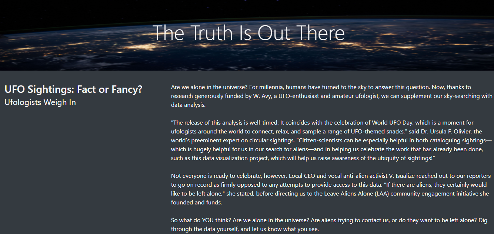
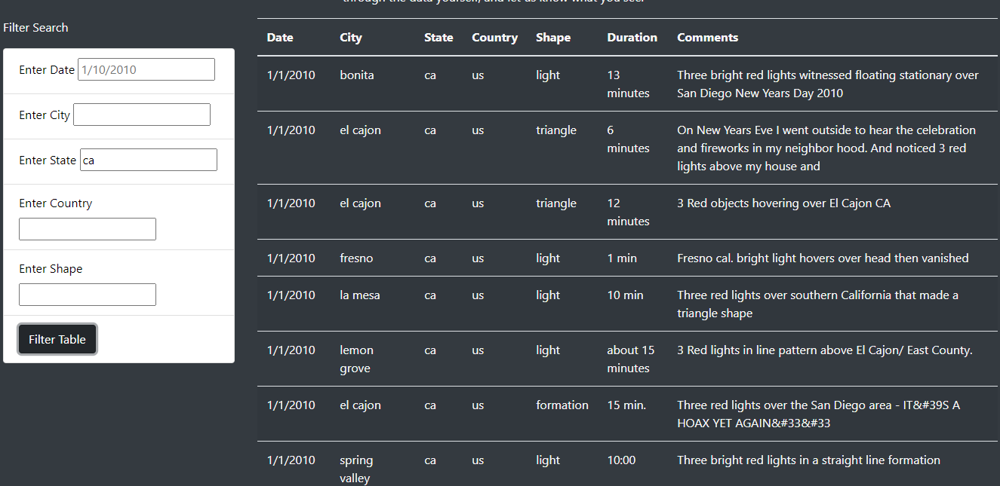

# UFO

UFO is still myth for its exsitence. However, out of curiosity, we collected all these observations and created a webpage to display these UFO sightings.

## Project Overview
This project involves creating a table using JavaScript, HTML, and CSS from a list of dictionaries of UFO sigthing for users to filter specific information. 

## Resources
Data Source: data.js
Software: Python 3.7.6, Visual Studio Code 1.43.0, HTML, CSS, JavaScript (ES6)
Libraries: Bootstrap, D3.js

## Summary

Viewers can filter the information in Date, City, State, Country or Shape based on their perferenece 

## Recommendation:
The purpose of this website is to allow users to look for UFO detail information by filtering relavent values. In order to create robust webpage, here is the recommendation.

The article is one of the static parts of the webpage. Instead, we can scrape a webpage that we get our articles from and have the updated article display on our webpage with a click of a button.

## Usage
Note: Please ensure you have all the required and updated softwares on your computer.

1. Download the following files into the same folder for the project.

static folder
index.html

2. Open Visual Studio Code from your project's folder.

3. Open the index.html in your browser and enter the input for the filters.

4. If you want to change anything in the code, make your changes, save your file and refresh your browser. The changes should be loaded into the webpage.

